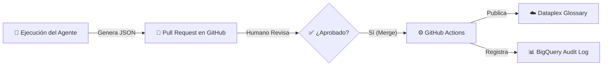

# 📘 Manual de Operación: Agente de Gobierno de Datos con IA

Este documento describe el flujo de trabajo completo para utilizar el Agente de IA que genera y publica automáticamente Glosarios de Negocio en Google Cloud Dataplex.

## 🔄 Flujo del Proceso

El proceso consta de 4 etapas principales:



---

## Prerequisitos

1. Activar el entorno virtual:
   ```bash
   .venv\Scripts\activate
   ```
2. Instalar dependencias:
   ```bash
   pip install -r requirements.txt o python -m pip install -r requirements.txt
   ```
3. Configurar credenciales de GCP (Application Default Credentials):
   ```bash
   gcloud auth application-default login
   ```
4. Configurar variables de entorno (ver `config/`).


### 1. 🚀 Ejecución del Agente (Generación)
El proceso comienza ejecutando el agente localmente o programado.

**Comando:**
```bash
python main.py
```

**Lo que hace el agente:**
1.  Conecta a **BigQuery** y lee los metadatos (tablas, columnas, comentarios) del dataset deseado.
2.  Envía estos metadatos a **Gemini 2.5 Flash**.
3.  Gemini genera una estructura de Glosario rica (Categorías, Términos, Descripciones funcionales) a partir del metadatado ingestado de la fuente establecida.
4.  Crea una **rama nueva** en GitHub y abre una **Pull Request (PR)** con la propuesta en formato JSON.

---

### 2. 📝 Revisión Humana (Gobierno)
Un Data Steward (usuario) recibe la notificación de la PR en GitHub.

**Acciones:**
1.  Revisar el archivo JSON propuesto en la pestaña "Files changed".
2.  Puede sugerir cambios o correcciones directamente en GitHub.
3.  Si está conforme, hace clic en **"Merge pull request"**.

---

### 2.1 ⚙️De momento, para ejecuciones locales para la publicación en Dataplex y Bigquery se debe de ejecutar el script `scripts/publish_glossary.py`.

---

### 3. ⚙️ Publicación Automática (CI/CD)
Al aprobar (hacer merge) la PR, se dispara automáticamente un flujo de trabajo ("Deploy Business Glossary").

**Lo que ocurre en segundo plano:**
1.  GitHub Actions descarga la última versión aprobada del glosario.
2.  Ejecuta el script de publicación (`scripts/publish_glossary.py`).
3.  Usa la API de **Data Catalog** para crear o actualizar el Glosario en Google Cloud.
    *   Crea las Categorías.
    *   Crea los Términos asociados.
    *   Aplica descripciones y etiquetas.

---

### 4. 📊 Auditoría y Trazabilidad
Como paso final, el sistema registra la operación.

**Destino:** BigQuery (`TABLA_DESEADA.glossary_audit_log`).
**Datos registrados:**
*   `timestamp`: Fecha y hora exactas.
*   `actor`: Usuario de GitHub que aprobó el cambio.
*   `status`: `APPROVED_AND_PUBLISHED` o `FAILED`.
*   `details`: Número de términos publicados y nombre del archivo.

---

## 🛠️ Configuración Previa Requerida

Para que este flujo funcione, se necesitan los siguientes secretos en el repositorio de GitHub:

1.  `GCP_SA_KEY`: JSON de una Service Account de Google Cloud con permisos de **Data Catalog Admin** y **BigQuery Data Editor**.
2.  `GCP_PROJECT_ID`: ID del proyecto (ej. `pg-gccoe-carlos-monteverde`).

---

## 💡 Preguntas Frecuentes

**¿Qué pasa si rechazo la PR?**
Nada se publica en Dataplex. El proceso se detiene y no hay cambios en el entorno productivo.

**¿Cómo cambio el dataset a analizar?**
Edita la variable `TARGET_DATASET` en `main.py`.

**¿Dónde veo los logs de error si falla la publicación?**
En la pestaña "Actions" de GitHub, dentro del fallo del workflow "Deploy Business Glossary". También se registrará un evento `FAILED` en la tabla de auditoría de BigQuery si el error lo permite.
