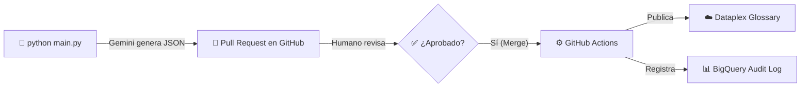

# 📘 Manual — Agente de Glosario de Negocio (business-glossary)

Este repo es el **agente-pilar de Glosario** del gobierno del dato. Es genérico, multi-cliente:
no asume ningún proyecto concreto, y hoy contiene **dos flujos distintos** (dos pestañas de la
misma UI) que conviene no confundir:

| | 🔎 Onboarding de tabla (buscarV) | 🤖 Generar glosario (IA) |
|---|---|---|
| **Qué hace** | Escanea una tabla NUEVA y la empareja columna a columna contra el glosario central existente; propone enlaces + términos nuevos | Escanea un dataset ENTERO desde cero y le pide a Gemini que invente una estructura de glosario completa |
| **Fuente de verdad del glosario** | El **repo de gobierno del cliente** (`GOVERNANCE_REPO_PATH`; ej. real en DIA: `dataplex-sara`, publicado a `dia-es-sara-dev`) | Ninguna: genera un JSON nuevo, sin cruzar con nada existente |
| **Destino de la propuesta** | `<repo-de-gobierno>/proposals/<tabla>/` (para Merge Request en GitLab) | Pull Request en **este** repo de GitHub |
| **Publicación** | La hace `<repo-de-gobierno>/scripts/publish_all.py` (ver su manual) | GitHub Actions de este repo (`.github/workflows/`), sobre un proyecto GCP de demo |
| **Estado** | ✅ Activo — es el que usa el [Hub de gobierno](../ai-agent-data-governance-hub) como pilar "glosario" | 🧪 Prototipo/demo original, funcional pero desconectado del flujo de cliente |
| **Motor** | `modules/glossary_matcher.py` | `main.py` + `modules/business_glossary.py` + `core/github_client.py` |

**Si tu duda es "cómo doy de alta una tabla nueva en el glosario del cliente", es la pestaña
🔎 Onboarding la que quieres** — y probablemente prefieras usar el
[Hub de gobierno](../ai-agent-data-governance-hub) (`ai-agent-data-governance-hub`), que orquesta
este mismo motor junto con calidad, policy & control, productos y contratos en una sola pantalla.

---

## 0. Arranque rápido (UI con las dos pestañas)

```bash
cd ai-agent-data-governance-business-glossary
python -m venv .venv && .venv\Scripts\activate      # Windows
pip install -r requirements.txt
gcloud auth application-default login

# Obligatoria para la pestaña Onboarding: repo de gobierno del cliente (fuente de verdad)
set GOVERNANCE_REPO_PATH=C:\ruta\al\repo-de-gobierno-del-cliente

python app.py     # → http://localhost:5000
```

Sin `GOVERNANCE_REPO_PATH`, la pestaña Onboarding falla con un error explícito — no hay ningún
repo por defecto asumido, para que este agente sirva igual a cualquier cliente.

---

## 1. 🔎 Pestaña "Onboarding de tabla" (buscarV) — el flujo real

### 1.1 Qué hace, paso a paso

1. Escribes **proyecto.dataset.tabla** de BigQuery → `scan_table()` lee el esquema y hace un
   "buscarV" de cada columna contra el índice del glosario central (`glossary/domains/` +
   `glossary/column_links/` del repo de gobierno, vía "efecto red": si otra tabla ya mapeó esa
   columna a un término, se reutiliza).
2. Cada columna sale con: coincidencia **exacta**, **aproximada** (fuzzy, `difflib`) o **sin
   match** (queda en blanco `-` para completar a mano).
3. Para una columna sin match, el botón ✨ (`suggest_term()`) le pide a Gemini un término
   completo (nombre, definición, overview, dominio, categoría, sinónimos), mapeando siempre a la
   **taxonomía ya existente** (no inventa dominios/categorías nuevas si ya hay uno que encaja).
   El nombre de cada dominio se lee de su propio `_glossary.yaml` — no hay ninguna convención de
   nombrado hardcodeada, funciona con la taxonomía que tenga cada cliente.
4. Al aceptar, `build_proposal()` genera dos YAML (enlaces `column_links` + términos nuevos en
   `DRAFT`) y `write_proposal()` los escribe en `<repo-de-gobierno>/proposals/<tabla>/`.
5. Desde ahí, un Data Steward abre Merge Request en **GitLab** (no en este repo) y, al aprobarlo,
   el pipeline del repo de gobierno publica a Dataplex. Detalle completo: el `MANUAL.md` de ese repo.

### 1.2 Motor (`modules/glossary_matcher.py`)

| Función | Qué hace |
|---|---|
| `build_index()` | Índice columna→término a partir de `glossary/domains/*.yaml` + `column_links/*.yaml` |
| `read_bq_columns()` | Lee el esquema real de la tabla en BigQuery |
| `match_columns()` | Cruce exacto → aproximado → sin match |
| `scan_table()` | Punto de entrada de la pestaña: junta las tres anteriores |
| `suggest_term()` | IA (Gemini/Vertex): propone un término nuevo mapeado a la taxonomía existente |
| `build_proposal()` / `write_proposal()` | Genera y escribe los YAML de propuesta |

Este módulo es el que **reutiliza sin duplicar** el [Hub de gobierno](../ai-agent-data-governance-hub)
(`adapters/glossary.py` hace `from modules.glossary_matcher import scan_table, suggest_term, …`).

### 1.3 Endpoints Flask (`app.py`)

`POST /onboard/scan`, `POST /onboard/suggest`, `POST /onboard/propose` — ver código, son un wrapper
fino de las tres funciones de arriba.

---

## 2. 🤖 Pestaña "Generar glosario (IA)" — flujo original (prototipo)

Genera un glosario **desde cero** para un dataset completo, sin cruzar con nada existente. Útil
para explorar/demostrar, pero **no** es el camino para dar de alta tablas en el glosario real de
un cliente (para eso, sección 1).


```mermaid
graph LR
    A[🚀 python main.py] -->|Gemini genera JSON| B[📝 Pull Request en GitHub];
    B -->|Humano revisa| C{✅ ¿Aprobado?};
    C -- Sí (Merge) --> D[⚙️ GitHub Actions];
    D -->|Publica| E[☁️ Dataplex Glossary];
    D -->|Registra| F[📊 BigQuery Audit Log];
```

### 2.1 Cómo funciona

1. `main.py` lee metadatos de BigQuery (o un PDF en Drive) del `TARGET_DATASET` configurado
   (por defecto un **proyecto de demo/sandbox**, no el de ningún cliente real).
2. `modules/business_glossary.py` (`BusinessGlossaryGenerator`) envía ese contexto a
   **Gemini 2.5 Flash**, que devuelve categorías + términos + descripciones.
3. `core/github_client.py` (`PyGithub`) crea una rama y abre un **Pull Request en este repo de
   GitHub** con el JSON propuesto (`output/*.json`).
4. Un Data Steward revisa el JSON en "Files changed" y aprueba el merge.
5. Al mergear a `main`, `.github/workflows/deploy_glossary.yaml` dispara
   `scripts/publish_glossary.py`, que usa `modules/dataplex_client.py`
   (`DataplexGlossaryClient`) para crear/actualizar categorías y términos vía la Business
   Glossary API.
6. Se registra la operación en BigQuery (`glossary_audit_log`): timestamp, actor, status
   (`APPROVED_AND_PUBLISHED` / `FAILED`), términos publicados.

### 2.2 Comando directo (sin UI)

```bash
python main.py
```

Parámetros configurables como argumentos de `main()`: `project_id`, `location`, `target_dataset`,
`glossary_id`, `glossary_display_name`, `data_source` (`bigquery`/`drive`), `drive_folder_id`,
`publish_mode` (`pull_request` por defecto).

### 2.3 Secretos requeridos (GitHub → Settings → Secrets)

| Secreto | Para qué |
|---|---|
| `GCP_SA_KEY` | Service Account con **Data Catalog Admin** + **BigQuery Data Editor** |
| `GCP_PROJECT_ID` | Proyecto GCP destino (sandbox/demo) |
| Token de GitHub (`PyGithub`) | Para que `core/github_client.py` pueda abrir el PR |

### 2.4 Motor reutilizado por el repo de gobierno del cliente

`modules/dataplex_client.py` (`DataplexGlossaryClient`: `create_or_update_glossary`,
`create_category`, `create_term`) es el **wrapper de la Business Glossary API** que el
`scripts/publish_glossary.py` del repo de gobierno del cliente importa vía `GOVERNANCE_AGENT_PATH`
— por eso este repo sigue siendo necesario aunque no publiques nunca desde su propio flujo de PR
de GitHub.

---

## 3. ⚠️ Código no usado en este repo (para no confundirse)

`src/agent/core.py` + `scripts/deploy.py` definen un `MetadataAgent` (LangChain +
`vertexai.preview.reasoning_engines`) pensado para desplegarse en **Vertex AI Agent Engine**. Es
del primer commit del repo, **nadie lo importa** y no forma parte de ninguno de los dos flujos de
arriba. Se deja como referencia histórica; si se retoma la idea de un agente conversacional real
(ver discusión de ADK/Agent Engine), este sería el punto de partida — hoy no está en uso.

---

## 4. 💡 Preguntas frecuentes

**¿Qué pestaña uso para dar de alta una tabla nueva en el glosario del cliente?**
🔎 Onboarding (sección 1) — o mejor, hazlo desde el [Hub de gobierno](../ai-agent-data-governance-hub),
que además encadena calidad, policy & control y contrato en el mismo paso.

**¿Onboarding también abre un Pull Request?**
No en GitHub: escribe en `<repo-de-gobierno>/proposals/` y desde ahí se abre **Merge Request en
GitLab** (botón 🦊 del Hub, o a mano — ver el `MANUAL.md` del repo de gobierno).

**¿Qué pasa si rechazo el PR de la pestaña "Generar glosario (IA)"?**
Nada se publica. El JSON se queda en la rama, sin tocar Dataplex.

**¿Cómo cambio el dataset de la pestaña "Generar glosario (IA)"?**
Edita `TARGET_DATASET` en `main.py`, o pásalo como parámetro desde la UI.

**¿Dónde veo logs de error?**
Onboarding: en la propia respuesta JSON del endpoint. Generación IA: pestaña "Actions" de GitHub
del workflow "Deploy Business Glossary", y evento `FAILED` en `glossary_audit_log` de BigQuery.

**¿Cómo lo reutilizo para otro cliente?**
No hace falta tocar código: exporta `GOVERNANCE_REPO_PATH` apuntando al repo de gobierno del
nuevo cliente (misma estructura: `glossary/domains/`, `glossary/column_links/`) y arranca
`python app.py`. El motor lee la taxonomía y los nombres de dominio directamente de ese repo.
